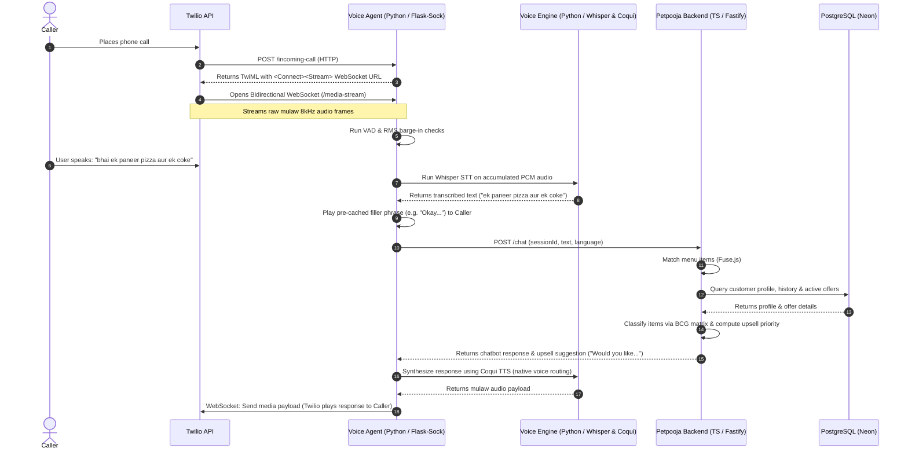

# AI Voice Ordering Copilot
> A bidirectional voice assistant for restaurant phone ordering that integrates with point-of-sale systems, processes multilingual customer speech, and optimizes revenue via dynamic combo matching.


## Overview
AI Voice Ordering Copilot is a modular, real-time voice interface designed to automate phone ordering for restaurants. By connecting Twilio media streams to an offline Python voice agent and a TypeScript/Fastify point-of-sale (POS) backend, the system transcribes customer speech, parses menu selections using vector-based similarity search, and processes transactions. Additionally, a revenue intelligence module evaluates historical ticket data using BCG matrix classification to recommend high-margin upsells and combo matches during the live call.

## Key Features
- **Implemented** a real-time voice streaming pipeline using Twilio Media Streams, Flask-Sock WebSockets, and audio VAD/RMS thresholds to handle bidirectional call audio.
- **Engineered** an offline multilingual Speech-to-Text (STT) and Text-to-Speech (TTS) engine using local Whisper (`tiny`, `base`, `small`) and Coqui TTS models supporting 10 Indian languages.
- **Optimized** system response latency by pre-warming the Coqui TTS cache with language-specific filler phrases (e.g., "Okay...", "Haan ji...") and running background audio keepalive frames.
- **Built** a custom vector database retriever in TypeScript using `gemini/text-embedding-004` to parse customer requests with metadata filters for veg, vegan, cuisine, availability, and price.
- **Developed** a revenue intelligence engine in TypeScript utilizing BCG matrix analysis (classifying items into Star, Hidden Star, Risk, and Dog) to suggest combo matches and prioritize high-margin upsells.
- **Automated** order lines and customer profile tracking in a PostgreSQL schema with Neon Serverless to update order history, turnaround times, and segmentation.

## Tech Stack
**Backend & Database:** Fastify, Flask, PostgreSQL (Neon Serverless), Node.js, TypeScript, pg, SQLCoder-7b-2 (NL-to-SQL)  
**ML/AI & Speech:** Whisper, Coqui TTS, Deepgram SDK, gTTS, rapidfuzz, Fuse.js, PyTorch, librosa, sounddevice  
**Telephony & Tunneling:** Twilio API, Twilio Media Streams, Flask-Sock, websockets, pyngrok, Cloudflare Tunnel (localhost.run)  
**Infra & Testing:** Docker, Docker Compose, ts-node, Jest, Pytest  

`Tech: Python, TypeScript, Node.js, Fastify, Flask, PostgreSQL, Neon, Whisper, Coqui TTS, Deepgram, Twilio, Docker, Docker Compose, Jest, Pytest, rapidfuzz`

## Architecture
The system consists of three main components: the Fastify/TypeScript backend (`petpooja`), the WebSocket voice agent (`voice_agent`), and the offline speech pipeline (`voice_engine`). The diagram below outlines the end-to-end communication flow during an active call:



## Setup & Usage

### 1. Database Setup & Seeding
Navigate to the `petpooja` directory, create your environment configuration, install packages, and initialize the PostgreSQL database:
```bash
cd petpooja
cp .env.example .env
# Edit .env and supply your PostgreSQL connection URI and OpenAI API credentials
npm install
npm run migrate
npm run seed
```

### 2. Voice Agent Configuration
Create a `.env` file in the `voice_agent` directory with your Twilio credentials:
```env
TWILIO_ACCOUNT_SID=ACxxxxxxxxxxxxxxxxxxxxxxxxxxxxx
TWILIO_AUTH_TOKEN=your_auth_token
TWILIO_PHONE_NUMBER=+1XXXXXXXXXX
NGROK_AUTHTOKEN=your_ngrok_token
```

### 3. Launching the System
You can start all components simultaneously using the cross-platform python launcher:
```bash
python3 run_all.py
```
This script cleans up active ports, launches the Fastify server on port 3000, starts the Flask-Sock WebSocket server on port 5050, initiates the Cloudflare tunnel, and configures the Twilio webhook.

To run components manually:
- **POS / Chat Backend**: `cd petpooja && npm run dev`
- **Twilio Voice Agent**: `pip3 install -r voice_agent/requirements.txt && python3 voice_agent/start_agent.py`
- **Offline Voice Engine Demo**: `cd voice_engine && pip3 install -r requirements.txt && python demo_pipeline.py`

## Results / Impact
- **1** restaurant seeded in database (`Tadka & Twist` in Ahmedabad).
- **20** menu items populated in database, including **1** intentional duplicate entry for error-detection testing.
- **3** pre-calculated menu combos stored for association mining.
- **2** active threshold-based cart discount offers (10% off above ₹500, 20% off above ₹900).
- **10** completed restaurant orders across App, Voice, and Walk-in channels.
- **3** mock customer profiles with detailed visit counts and segmentations (Loyal, Regular).
- **19** unit test cases in the offline speech engine suite.

## Challenges & Learnings
- **Outbound Audio Echo (Barge-in)**: Twilio echoes outbound audio back as inbound media. Without a dynamic muting window (`BOT_BASE_MUTE_FRAMES`) and barge-in echo shield frames (`BARGE_IN_ECHO_SHIELD_FRAMES`), the agent transcribes its own voice and creates an infinite reply loop.
- **LLM Thinking Latency**: Synthesizing the LLM response took 2–8 seconds, creating dead silence on live phone calls. We solved this by implementing an instant filler/acknowledgement phrase mechanism cycling through language-specific terms (e.g. "Okay...", "Haan...") served directly from cache while the LLM runs.
- **Ambient Noise Filtering**: Whisper transcribed sighs, breathing, or background noise into single characters or garbage tokens. We added an average RMS gate (`MIN_UTTERANCE_AVG_RMS`) and a word/probability filter to ignore low-energy or micro-transcripts.

## Future Improvements
- **Integrate Production POS Providers**: Replace the mock POS provider with real integrations for Petpooja, UrbanPiper, or POSist (stubs exist in config but logic is `generic`).
- **Support Full Local TTS Models in Agent**: Currently, the agent uses gTTS (Google TTS) in `voice_agent/tts_module.py` for Mulaw conversion, whereas `voice_engine` uses Coqui TTS. Merging the Coqui TTS engine directly into the live webhook WebSocket worker would make the audio pipeline fully offline.
- **Add Multi-Tenant Restaurant Support**: The current database and vector store map primarily to a single restaurant context (`restaurant_id = 1` or `DEFAULT_RESTAURANT_ID=rest_001`). Multi-tenant session state handling would be needed for wider deployment.
